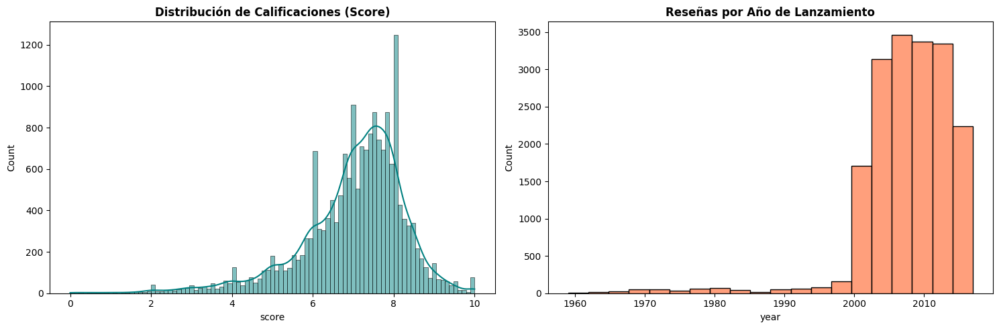
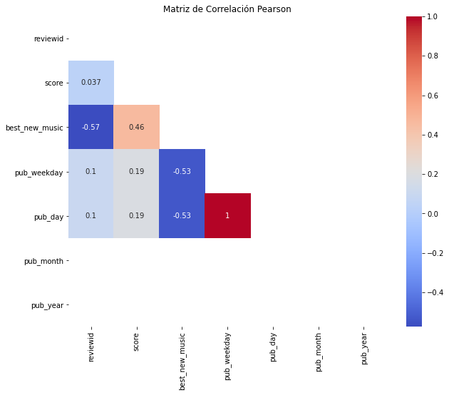
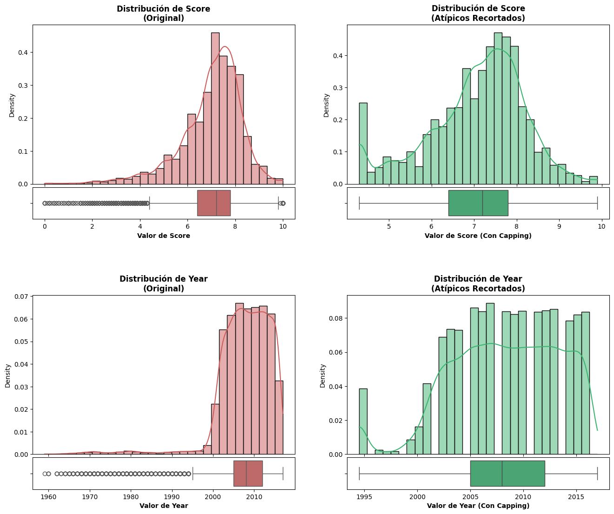
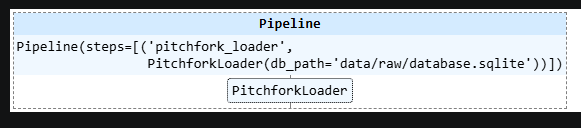

# Informe Técnico: Preparación de Datos - Pitchfork Reviews 🎵

**Equipo:** Gabriel Caroca, Alejandra Norambuena, Stephanie Chamorro
**Asignatura:** SCY1101 - Programación para la Ciencia de Datos  
**Fecha:** 16-04-2026 

---

## 1. Resumen Ejecutivo
Este proyecto tiene como objetivo procesar el dataset de reseñas musicales de Pitchfork para preparar los datos para un análisis de tendencias y modelado futuro. Se implementó un flujo de trabajo reproducible que incluye la consolidación de tablas relacionales desde SQLite, auditoría de integridad, limpieza de metadatos y análisis estadístico descriptivo, asegurando la escalabilidad mediante una estructura de carpetas profesional.

## 2. Análisis Exploratorio Inicial (EDA)

<class 'pandas.DataFrame'>
RangeIndex: 18393 entries, 0 to 18392
Data columns (total 13 columns):
 #   Column          Non-Null Count  Dtype  
---  ------          --------------  -----  
 0   reviewid        18393 non-null  int64  
 1   title           18393 non-null  str    
 2   artist          18393 non-null  str    
 3   url             18393 non-null  str    
 4   score           18393 non-null  float64
 5   best_new_music  18393 non-null  int64  
 6   author          18393 non-null  str    
 7   author_type     14487 non-null  str    
 8   pub_date        18393 non-null  str    
 9   pub_weekday     18393 non-null  int64  
 10  pub_day         18393 non-null  int64  
 11  pub_month       18393 non-null  int64  
 12  pub_year        18393 non-null  int64  
dtypes: float64(1), int64(6), str(6)
memory usage: 1.8 MB

Aquí se presenta la variable score,su cantidad y su comparación con el año. En ambas presenta una asimetría negativa.

Se analizó la relación entre las variables numéricas para identificar posibles redundancias

---
## 3. Metodología de Transformación
Para asegurar la calidad de los datos sin perder información valiosa, se tomaron las siguientes decisiones técnicas, justificadas por las reglas del negocio:

* **Tratamiento de Valores Atípicos:** Con las variables score y year aplicamos recorte y límites IQR para manejar nulos, a continuación se presentan los gráficos con y sin Outliers.

* **Optimización:** Para optimizar la memoria transformamos score a float32, transformamos pub_year a integer y transformamos genero en categoria.

* **Valores nulos:** Para valores nulos en el caso de genero y disquera en albums, asignamos los valores “unassigned” e “independent” respectivamente

---
## 4. Resultados y Validación Técnica
El proceso fue validado mediante auditorías automáticas y técnicas de ingeniería de datos:
* **Integridad (Checksum):** El archivo original fue validado exitosamente generando su firma SHA-256 ("e9026a657395bb004cc788903e8ccc39e138f69b3e08d1ebd0d4d985dfa78a63"), confirmando la ausencia de corrupción de datos.
* **Optimización de Memoria:** Se implementó una técnica de *Downcasting* numérico, logrando reducir el peso del dataset en memoria en un 9.37%.
* **Pipelines de Scikit-Learn:** Se consolidó una arquitectura de procesamiento robusta que garantiza la reproducibilidad en entornos de producción.

---
## 5. Conclusiones y Recomendaciones
* **Conclusiones:** El tratamiento de datos permitió rescatar la mayor cantidad de registros útiles, empaquetando la limpieza en un formato automatizado.
* **Lecciones Aprendidas:** El uso de herramientas de control de versiones (Git) y entornos virtuales (`.venv`) demostró ser fundamental para evitar conflictos de dependencias.
* **Mejoras Futuras:** Se recomienda explorar algoritmos más avanzados de imputación (ej. KNN Imputer) para variables categóricas complejas. 